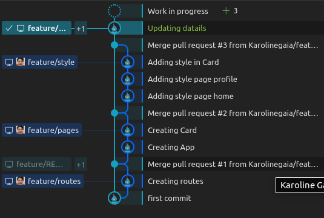
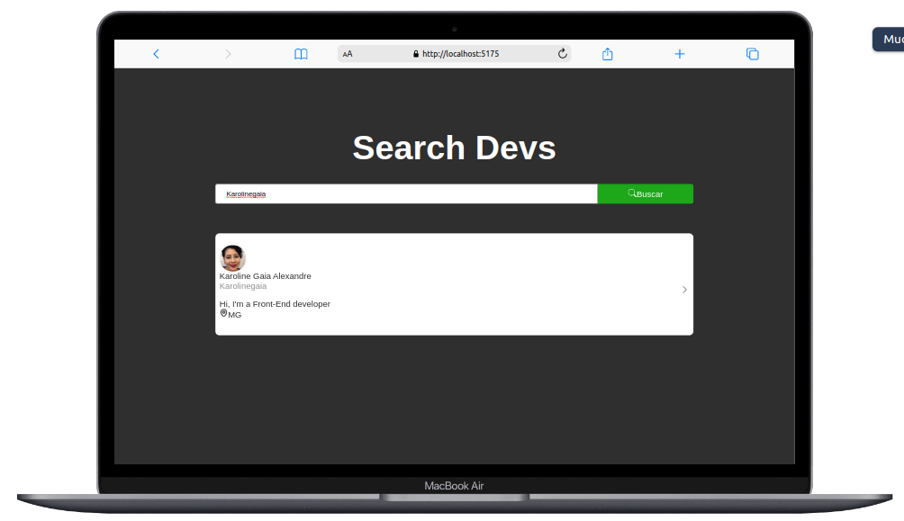
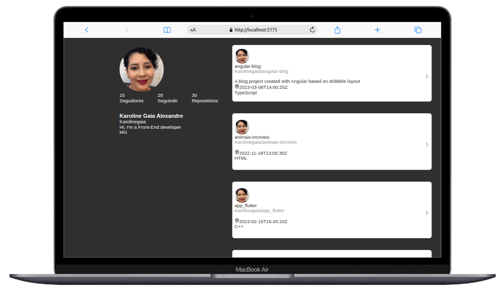

<a id='ancora'></a>
# GitHub Search

<br>
This is a challenge for Makasí.

<br>

[Link da Desafio](https://vercel.com/karolinegaia/github-api/EBi4pHYqLGoMA5UuPLgfdp3RusrC)


<br><br>

- [Sobre a Makasí](#ancora1) <br>
- [Sobre o Desafio](#ancora2) <br>
- [Sobre o Projeto](#ancora3) <br>
- [Requisitos Obrigatórios](#ancora4) <br>
- [Competências Desenvolvidas](#ancora5) <br>
- [Execução](#ancora6) <br>
- [Desenvolvedora](#ancora7)

<br><br>

<a id="ancora1"></a>

## Sobre a Makasí

<br>

<p align="center">
  
</p>

<br>

São um time apaixonado pelo propósito de impactar a vida de milhões de pessoas, que amam construir e são movidos por desafios que parecem impossíveis. 


<br>

<a id="ancora2"></a>

## Sobre o Desafio

<br>

Construir uma aplicação web em ReactJS que atinja o seguinte objetivo: buscar o perfil de desenvolvedores na API pública do GitHub e exibir os seus dados em uma página de perfil.
<br>

Ao entrar na home page, devo pesquisar o usuário pelo seu username do GitHub e ter os dados do usuário exibidos corretamente na página de perfil.

<br>

<a id="ancora3"></a>
## Sobre o Projeto

<br>

O projeto foi montado seguindo as boas práticas de Code Review, registrando toda e qualquer entrada de informação via Pull Requests, o que facilitaria a montagem de pipelines de teste de código e/ou gestão de conflitos de branchs, conforme árvore de commits:

<p align="center">
  
</p>

<br>

Para este projeto foram utilizadas as seguintes tecnologias:

<br>

* 

* 


* 

* 


<br>

<a id="ancora4"></a>
## Requisitos Obrigatórios

<br>

### Requisito 1
*  O teste deve ser feito utilizando a library de ReactJS com function components

<br>

### Requisito 2
*  Deve-se utilizar rotas com a library react-router-dom, e recomendamos o uso da funcionalidade de history do react-router-dom também
    <p align="center">
    
    </p>
    <p align="center">
    
    </p>


### Requisito 3
* O teste deve conter duas rotas: a rota “home” da página de busca, e a rota “profile” que exibe o perfil do usuário pesquisado.
 

<br>

<a id="ancora5"></a>
### 
## Competências Desenvolvidas

<br>

* Git Flow para controle e versionamento do código;
* Uso de framework para organização do código;
 

<br>

<a id="ancora6"></a>
## Execução 

<br>

1. Clone este repositório remoto em seu equipamento:
```
git clone git@github.com:Karolinegaia/github-api.git
```

2. Acesse a pasta do projeto:
````
cd github-api
````

3. Abra o VSCode ou IDE de sua preferência:
````
code .
````

4. Instale as dependências registradas no package.json:
````
npm install
````

5. Inicialize o React App:
````
npm run dev
````

<br>

<a id="ancora7"></a>
## Desenvolvedora

Projeto desenvolvido por:

<table align="center">
  <tr>
    <td align="center">
      <a target="_blank" href="https://www.linkedin.com/in/karoline-gaia-alexandre/">
        <br>
        <sub>
          <b>Karoline Gaia Alexandre</b>
           <p>Front-End</p>
        </sub>
      </a>
    </td>
  </tr>
</table>

<br><br>

[Voltar ao Topo](#ancora)